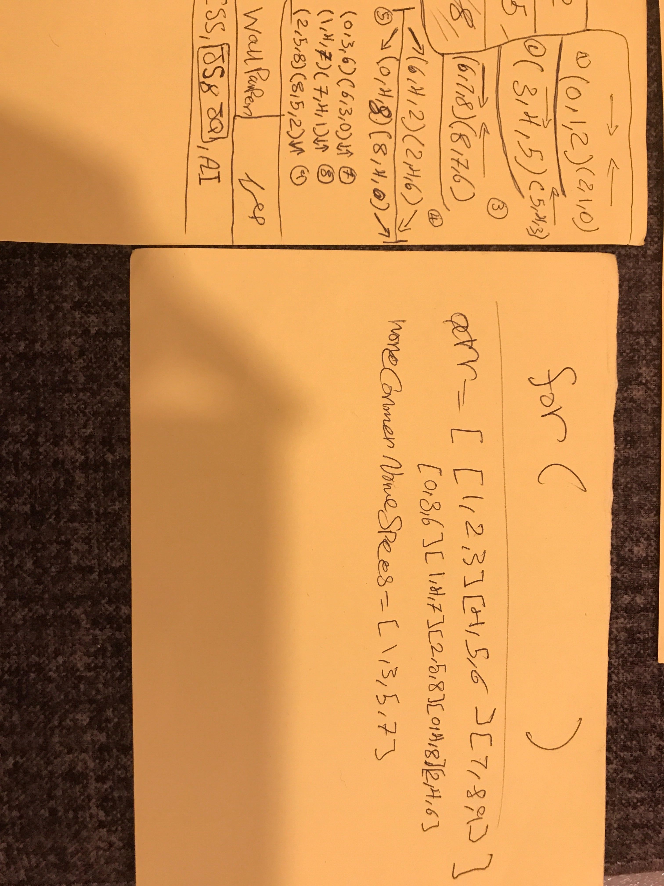
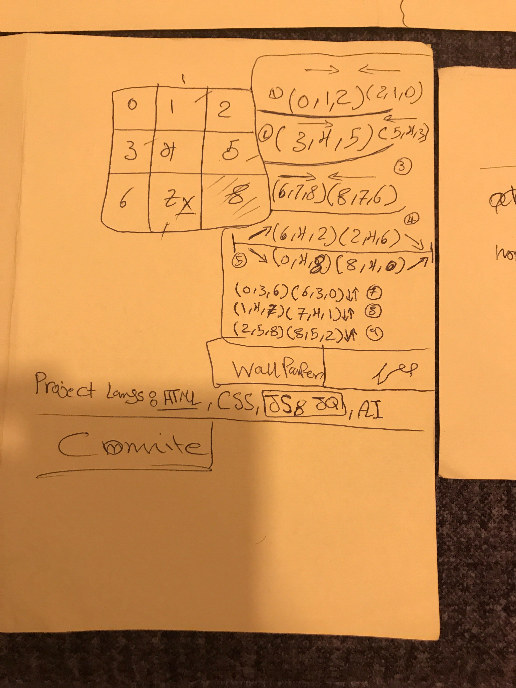

# Project Title
 
 I made a game called Tic Tac Toe and it is one of the ganes that is NOT easy to create. I found it very nice challange to have. 
## Description

a brief descrebtion about the game. it is a game that we can play it with 2 players. In my game we are playing aginst the computer not humen. So 
### Technical Used
I used sevral technologies that helped me build this Game. 

```
Example:
HTML
CSS
JavaScript
jQuery for DOM manipulation
Loops 
If Statments 
functions 


```

### Wireframes

Your step by step planning sketch of your project, that you can post them as an image in here.





### User Stories

user will open the website then will find the Home Page 
where the instruction and introduction about the game will be there 
user will Click on the game botton then will take him/her to the Board 
User will pick whatever they want BUT I prefere choosing X since this is one of the rules that the player should always start with 'X'. 
---

## Planning and Development Process

I did my psudecode and Brainstorm to create the game useing 2D Arrays and For Loop and If statments. 
### Problem-Solving Strategy

read read read practice practice practice 
### Unsolved problems


I need to wrok more on my skills regrding functions because I think I can bring more to the table. Even though, I'm not fully satsfaied but Im pretty much sure that I covered all th requirments. 
## Acknowledgments

*Thanks to all instructors for helping me through the proccess.

and My classmates that helped me go throgh the first experment secssfuly. 
Eberee is a Huge help for everyone beacuse he always make life easy and keep you on the same page. 
 last but Not least, a big SO to my frind Mohammed Alfaisal for trying to explain the concept of AI and the impact of the function in our daily life. 

---

 ## References

1. https://www.youtube.com/watch?v=l-hh51ncgDI
2. https://sweetalert2.github.io/
3. https://developer.mozilla.org/en-US/docs/Web/JavaScript/Reference/Global_Objects/Array/indexOf

